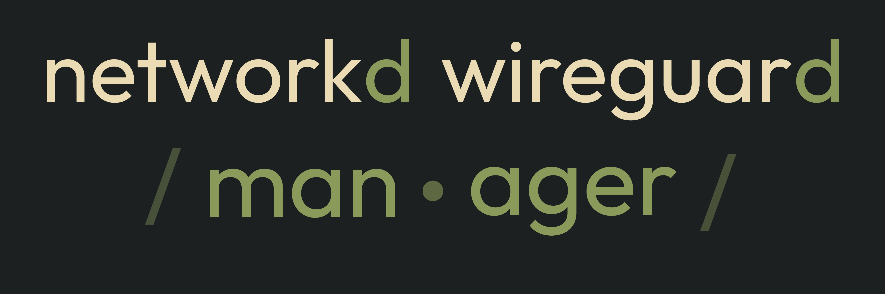
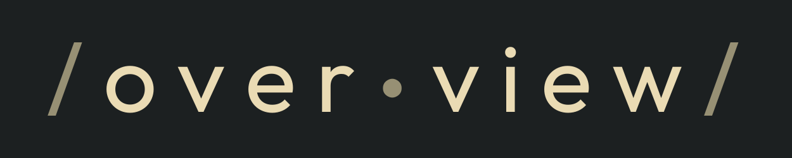
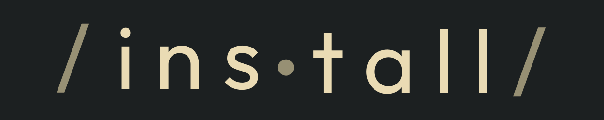

    

    A user-friendly GUI for managing  <a href="https://www.wireguard.com/">WireGuard</a> configurations. Seamlessly switch between VPN connections without manually editing files, with a focus on <a href="https://mullvad.net/en">Mullvad</a> integration.

### Acknowledgements
*  [Rust](https://www.rust-lang.org/)
*  [EGui](https://github.com/emilk/egui)
*  Graphics created with [Inkscape](https://inkscape.org/)
*  Font used in graphics: [Outfit](https://github.com/Outfitio/Outfit-Fonts)

### [License](./LICENSE)
